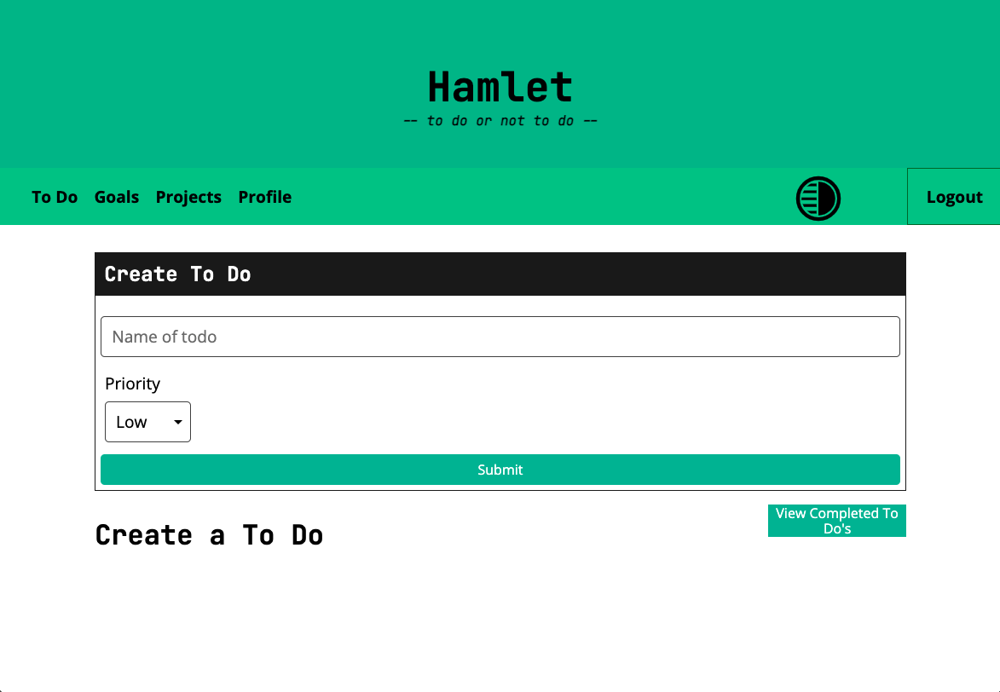
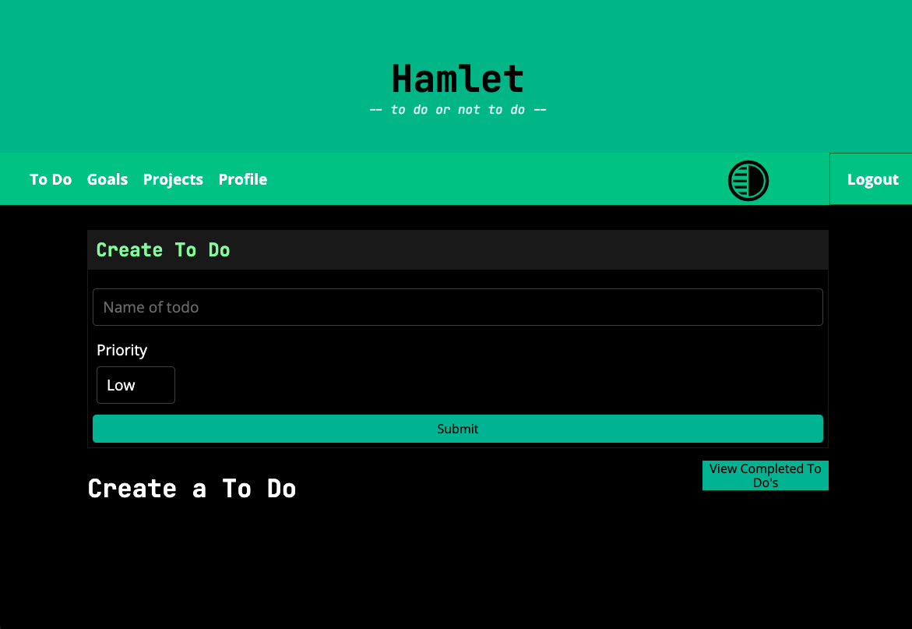

# goals-to-do

<div id="top"></div>
<!--
*** Thanks for checking out the Best-README-Template. If you have a suggestion
*** that would make this better, please fork the repo and create a pull request
*** or simply open an issue with the tag "enhancement".
*** Don't forget to give the project a star!
*** Thanks again! Now go create something AMAZING! :D
-->


<!-- PROJECT SHIELDS -->
<!--
*** I'm using markdown "reference style" links for readability.
*** Reference links are enclosed in brackets [ ] instead of parentheses ( ).
*** See the bottom of this document for the declaration of the reference variables
*** for contributors-url, forks-url, etc. This is an optional, concise syntax you may use.
*** https://www.markdownguide.org/basic-syntax/#reference-style-links
-->

[](https://opensource.org/licenses/MIT)





<!-- PROJECT LOGO
<br />
<div align="center">
    
  </a>

<h3 align="center">budget-tracking-app</h3>

  <p align="center">
    project_description
    <br />
    <a href="https://github.com/github_username/repo_name"><strong>Explore the docs »</strong></a>
    <br />
    <br />
    <a href="https://github.com/github_username/repo_name">View Demo</a>
    ·
    <a href="https://github.com/github_username/repo_name/issues">Report Bug</a>
    ·
    <a href="https://github.com/github_username/repo_name/issues">Request Feature</a>
  </p>
</div> -->


<!-- TABLE OF CONTENTS -->
<details>
  <summary>Table of Contents</summary>
  <ol>
    <li>
      <a href="#about-the-project">About The Project</a>
      <ul>
        <li><a href="#built-with">Built With</a></li>
      </ul>
    </li>
    <li>
      <a href="#getting-started">Getting Started</a>
      <ul>
        <li><a href="#prerequisites">Prerequisites</a></li>
        <li><a href="#installation">Installation</a></li>
      </ul>
    </li>
    <li><a href="#usage">Usage</a></li>
    <li><a href="#contributing">Contributing</a></li>
    <li><a href="#contact">Contact</a></li>
    <li><a href="#acknowledgments">Acknowledgments</a></li>
  </ol>
</details>


<!-- ABOUT THE PROJECT -->
## About The Project

* Concept and Motivation: We wanted to create an easy to use To Do application that allows the user to keep track of the TODOs within their every day life.


<p align="right">(<a href="#top">back to top</a>)</p>


### Built With

* [Express.js](https://expressjs.com/)
* [GraphQL](https://graphql.org/)
* [Node.js](https://nodejs.dev/)
* [Heroku](https://id.heroku.com/login)
* [MongoDB](https://www.mongodb.com/)


<p align="right">(<a href="#top">back to top</a>)</p>


<!-- GETTING STARTED -->
## Getting Started

To get a local copy up and running, follow these simple steps.


### Prerequisites

This is an example of how to list things you need to use the software and how to install them.
* npm
  ```sh
  npm install npm@latest -g
  ```
* npm run develop
  ```sh
  npm run develop
  ```
* MongoDB download: [https://www.mongodb.com/](https://www.mongodb.com/)   

### Installation

1. Clone the GitHub repository:
   ```sh
   git clone https://github.com/b-e-christensen/goals-to-do
   ```
2. Install NPM packages:
   ```sh
   cd goals-to-do && npm install

3. Configure the .env file with:
   ```js
    SESS_SECRET=<secure key for cookie gen>
   ```

<p align="right">(<a href="#top">back to top</a>)</p>


<!-- USAGE EXAMPLES -->
## Usage

1. Sign up and Log into your Hamlet, To Do or not To Do account.

2. Create a To Do.

3. Name your To Do along with the priority (High, Medium, Low).

4. After clicking submit, your To Dos will populate.

5. You can then scroll through your To Do list and mark as complete and/or remove.

<!-- _For more examples, please refer to the [Documentation](https://example.com)_ -->

<p align="right">(<a href="#top">back to top</a>)</p>


<!-- ROADMAP -->
## Roadmap for future development

- Improved UX by adding more client-side error handling and better mobile support.
- Auto-Expense: Direct banking API integration to automatically pull recent expenses.
- Oauth: Allows the user to sign in with their Google or Facebook accounts.

<!-- See the [open issues](https://github.com/github_username/repo_name/issues) for a full list of proposed features (and known issues). -->

<p align="right">(<a href="#top">back to top</a>)</p>


<!-- CONTRIBUTING -->
## Contributing

Contributions are what make the open source community such an amazing place to learn, inspire, and create. Any contributions you make are **greatly appreciated**.

If you have a suggestion that would make this better, please fork the repo and create a pull request. You can also simply open an issue with the tag "enhancement".
Don't forget to give the project a star! Thanks again!

1. Fork the Project
2. Create your Feature Branch (`git checkout -b feature/AmazingFeature`)
3. Commit your Changes (`git commit -m 'Add some AmazingFeature'`)
4. Push to the Branch (`git push origin feature/AmazingFeature`)
5. Open a Pull Request

<p align="right">(<a href="#top">back to top</a>)</p>


<!-- LICENSE -->
<!-- ## License

[](https://opensource.org/licenses/MIT) -->


<p align="right">(<a href="#top">back to top</a>)</p>


<!-- CONTACT -->
## Contact

<!-- Your Name - [@twitter_handle](https://twitter.com/twitter_handle) - email@email_client.com -->

Project Link: [https://github.com/b-e-christensen/goals-to-do](https://github.com/b-e-christensen/goals-to-do)

<p align="right">(<a href="#top">back to top</a>)</p>


<!-- ACKNOWLEDGMENTS -->
## Acknowledgments

* Ben Christensen
* Chris LeClair
* George "Eat Mor Chikin" Yoo
* Johnchris "Anon" Doeavis
* Kyle Salmons

<p align="right">(<a href="#top">back to top</a>)</p>